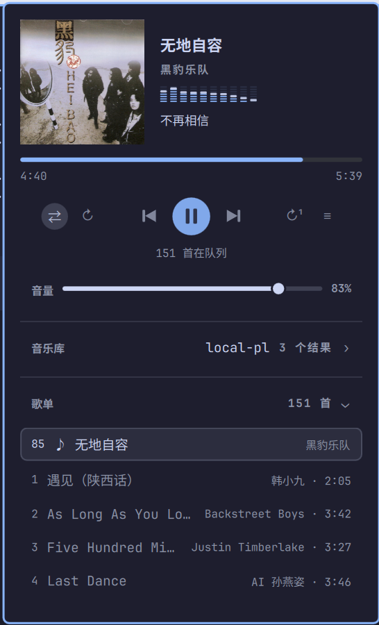

# Cliamp

[Cliamp](https://www.cliamp.stream/), in the Omarchy bar. The panel shows what is
playing and where it is going — and proves the signal reaching your DAC is
bit-perfect, something nothing else on this machine can tell you when a 44.1 kHz
track is quietly resampled to 48 kHz by default. Forked from
[thisisgm/omarchy-cliampui](https://github.com/thisisgm/omarchy-cliampui); the
differences are summarised under [This is a fork](#this-is-a-fork).



## Features

- **Now playing** with album art from cliamp's MPRIS status — or pulled out of the
  local file itself with ffmpeg when cliamp publishes no art — plus title,
  artist and album. A ten-bar analyzer spans the column underneath, drawn as
  stacked LED segments with a falling peak cap, fed by PipeWire's peak data
  rather than a second process.
- **Transport** with play, pause, previous and next centred, and four mutually
  exclusive mode buttons flanking them — sequential, shuffle, repeat-all,
  repeat-one — with the active mode pill-highlighted. The scrubber hides itself
  for radio rather than pretending a stream can be seeked.
- **Output and signal on one row**: the verdict on the left, OUTPUT and its
  device on the right. The row opens the sink list, and switching there moves
  cliamp's own stream, leaving the system default alone. When rate following is
  off, a one-click "Match rate" shortcut retunes the graph on the spot.
- **Lyrics** resolved by cliamp and shifted by the real output latency, so they
  line up with what you hear. A window of lines sits below the volume row with
  the active line large and centred; a toggle on the volume row hides them.
- **The playlist in the panel**: a song list of the live queue, keyboard driven,
  filterable by title or artist, with an honest count that survives filtering.
  The playing song is pill-highlighted and the list follows it on every change.
- **The library one search away**: one field searches songs, albums and saved
  playlists, browsed over the Subsonic token cliamp already publishes — no
  password is ever asked for here. Picking an album or song replaces the queue
  in place through a scratch playlist, so nothing pauses while you browse.
- **Rate following**, on by default: the audio graph is retuned to the track's
  sample rate while cliamp plays and released when it stops. Opt-in native
  playback relaunches cliamp at the file's own rate, working even with the panel
  closed.
- **Headless and resumable**: a sandboxed daemon keeps cliamp alive across
  logins, and whatever way cliamp was started it continues the last track and
  position where it stopped.
- **A footer that answers for itself**: the build version checks GitHub for a
  newer one when clicked, **退出** quits cliamp and hides the panel, the
  language label toggles the interface between 中文 and English, and the 主页
  link opens the repository.

Left click opens the panel; right click plays or pauses without opening it.

## The signal verdict

Three conditions must all hold before the words "bit-perfect" appear:

1. The server sent the original file — cliamp requests `format=raw` from
   Navidrome and gets untranscoded FLAC.
2. The sink rate equals the stream rate, read back from the sink after any
   change, never assumed from the requested rate.
3. Gain is unity — cliamp at 0 dB — and the EQ is flat. The panel reads the ten
   band values directly because cliamp labels an untouched EQ "Custom".

| What you see | What it means |
| --- | --- |
| `FLAC 44.1 kHz · bit-perfect` | samples reach the DAC untouched |
| `44.1 → 48 kHz · resampled` | the graph is at a different rate |
| `88.2 → 96 kHz · output has no 88.2` | the rate was requested and the hardware substituted another |
| `44.1 kHz · SBC-XQ · lossy` | a Bluetooth sink, which re-encodes and can never be bit-perfect |
| `FLAC 44.1 kHz · EQ applied` | a band is lifted or cut, so the samples are processed |
| `FLAC 44.1 kHz · volume applied` | rates line up but a gain is being applied |
| `MP3 · transcoded by server` | the file was re-encoded before it ever arrived |

The verdict is always read back from the sink, so the panel cannot claim a route
it did not get.

## Keyboard

| Key | Action |
| --- | --- |
| `space` / `enter` | play or pause, or pick a device when the output list is open |
| `n` / `b` | next and back |
| `j` / `k` / `up` / `down` | move the cursor when a list is open |
| `h` / `l` / `left` / `right` | seek 5 seconds (inert on a stream) |
| `o` | open and close the output list |
| `t` | open and close the song list |
| `s` | toggle shuffle between the sequential and shuffle modes |
| `r` | cycle repeat-all, repeat-one and off |
| `p` | toggle rate following |
| `/` | open the library, which puts the keyboard in the search field |
| `f` | wake the headless cliamp daemon, only when nothing is running |
| `q` | quit cliamp: a graceful SIGTERM, so it writes its resume state |
| `esc` | close |

Widget lists hand the keyboard to their search field, which answers `up`/`down`
(move the cursor), `enter` (play the highlighted row) and `esc` itself; a second
`esc` closes the panel.

## Settings

| Setting | Default | Notes |
| --- | --- | --- |
| Seconds between status refreshes | 2 | polls while the panel is open, and always while native rate following is on |
| Match the audio graph rate to the track | on | affects every application while music plays |
| Relaunch cliamp at the track's native rate | off | see the note below on restarting the daemon |
| Lyric timing trim in milliseconds | 0 | added on top of the measured output latency |
| Hide the icon when cliamp is not running | on | the panel still opens above it via the Start row |
| Path to cliamp | empty | empty means find it on `PATH` |
| Interface language | Auto | Auto follows the desktop locale; `English` / `中文` pin it |

## Notes worth reading once

**The daemon is sandboxed.** `cliamp-daemon.service` runs under `UMask=0077`
with a read-only system and home, writable only in `~/.config/cliamp`, the
runtime directory and the small state directory this plugin reads. What keeps
the log, the history and the playlists private is also the mode of
`~/.config/cliamp` itself — cover it with the `chmod` in the install steps, and
systemd plus the umask cover what the daemon writes afterwards.

**It resumes where it stopped.** cliamp loads the playlist whose file contains
the saved track and position — `cliamp-pick-playlist` searches the local
playlists for the path in `resume.json`, so no playlist name is baked in — then
`cliamp-resume-ipc` waits for the IPC socket and jumps directly to that track
and position. The same helper serves the daemon and a TUI started from a
terminal, so resume behaves identically everywhere.

**退出 hides the panel, and the shortcut only brings the icon back.** 退出 asks
cliamp to quit gracefully and then hides the widget from the bar. From a hidden
icon the shortcut or the desktop icon restores just the icon without reopening
the panel — click it to expand it again.

**It wakes headless, not in a terminal.** cliamp allows one instance per user, so
a second copy would be blind to the socket. The Start row and the `f` key appear
only while the socket is free, and wake the daemon in the background — the
sandboxed unit when installed, otherwise the same entry script run detached —
and nothing here opens a terminal.

**The library borrows a token, never a password.** The panel reads the stream URL
cliamp publishes, which carries a salted Subsonic token, and browses with it.
Nothing is stored and nothing new is exposed; the playlists on disk carry the
same token, which is also how browsing works from a cold start before anything
has played. The scratch playlist `cliampui` is overwritten on every pick and
hidden from the browse list, and its file is owner-only because its URLs carry
the token.

**Restarting the daemon for native rate gaps the audio.** cliamp fixes its output
rate at launch and has no command to change it, so playing a 96 kHz file
natively means restarting it. Because cliamp cannot seek a stream, a Navidrome
queue comes back at its first track; in a queue that mixes rates, skipping
across a boundary lands back there too. Off by default.

**Navidrome tracks cannot be scrubbed.** They arrive as HTTP streams, and asking
cliamp to seek one skips to the next track. The progress bar is drawn from the
reported duration but is not interactive for a stream, and the seek keys do
nothing there. Local files scrub normally.

**The volume slider moves cliamp's PipeWire stream, not its gain.** It changes
only this application, and cliamp itself stays at 0 dB. Anything under 100
percent alters samples and costs the bit-perfect verdict, which is why the
signal line then says `volume applied`. Right click the slider to return to
unity.

**Rate following touches the whole audio graph, not just cliamp.** While your
music plays at 44.1 kHz, a browser playing 48 kHz audio is resampled instead.
It is released the moment playback stops; turn it off in settings if that trade
is wrong for you.

**Bluetooth can never be bit-perfect.** A2DP re-encodes everything, and no
operating system sends lossless over it. The panel names the codec in use so you
can pick the least-bad one, but none earns the verdict.

**Enable this or the stock Media widget, not both.** They show the same track.

**A hard shell crash can leave the graph rate forced.** The panel releases it on
a clean shutdown, and the setting is session scoped:

```bash
systemctl --user restart pipewire
```

## Requirements

- `cliamp` 2.0 or newer on `PATH`, with the version 2 IPC protocol
- PipeWire, with `pw-metadata` and `pactl`, both of which ship with it
- `omarchy-audio-sink-availability`, part of Omarchy, used to hide outputs with
  nothing plugged in
- `curl`, for the footer's GitHub update check
- `python3` (plus `rg`), used by the resume and playlist-picker helpers
- `ffmpeg`, to pull an embedded album cover out of a local file when cliamp
  publishes none

## Install

```bash
omarchy plugin add https://github.com/ehlxr/omarchy-cliampui --enable
omarchy bar put io.github.ehlxr.cliampui --section right
```

`omarchy plugin add` is what lets `omarchy plugin update` manage the copy
afterwards; a hand-cloned folder works but is invisible to that command.

Then, once, point cliamp at your library and start the daemon:

```bash
cliamp setup
install -Dm644 ~/.config/omarchy/plugins/io.github.ehlxr.cliampui/cliamp-daemon.service ~/.local/share/systemd/user/cliamp-daemon.service
systemctl --user daemon-reload
systemctl --user enable --now cliamp-daemon.service
chmod -R go= ~/.config/cliamp
```

`cliamp setup` is what writes your Navidrome server into
`~/.config/cliamp/config.toml`; without it the provider never appears and the
daemon has nothing to play. The `chmod` sweeps what the unit does not: a daemon
started from an install that predates the sandbox keeps its old file modes.

## Removal

```bash
systemctl --user disable --now cliamp-daemon.service
rm -f ~/.local/share/systemd/user/cliamp-daemon.service
cliamp playlist delete cliampui
rm -rf ~/.local/state/omarchy/cliampui
omarchy plugin remove io.github.ehlxr.cliampui
```

`cliampui` is the scratch playlist whose stream URLs carry your token, so it
goes with the plugin. The state directory holds the one-shot sample-rate pin the
native-rate relaunch writes and the extracted covers (keyed by file, so they are
not re-peeled).

## Development

The pure-JavaScript parts each have a Deno suite:

```bash
deno run --allow-read tests/model.test.js
deno run --allow-read tests/strings.test.js
```

The model fixtures are lines a running cliamp actually printed, including the
88.2 kHz substitution this machine performs. The strings suite pins down that
every key the panel reads exists in both the English and the Chinese table.

## This is a fork

Forked from [thisisgm/omarchy-cliampui](https://github.com/thisisgm/omarchy-cliampui).
Compared with that upstream `main`:

- Speaks cliamp's **version 2 IPC protocol**, where operations answer with a job
  that is polled via `job.get` instead of the payload directly.
- Reworked the **transport** into four mutually exclusive modes — sequential,
  shuffle, repeat-all and repeat-one — with the active mode pill-highlighted.
- Kept the **playlist in the panel** as a filtering, keyboard-driven song list
  that follows the playing song.
- Added the **library** to the same panel, browsed over the published Subsonic
  token: one search field covers songs, albums and saved playlists.
- Merged **output and signal onto one row**, with a one-click "Match rate"
  shortcut when the rates disagree.
- Added **lyrics**, drawn from cliamp's own resolution, shifted by output
  latency, with a toggle on the volume row.
- Added headless **resume** (`cliamp-pick-playlist` + `cliamp-resume-ipc`), local
  cover extraction with ffmpeg, the icon restore/exit footer behaviour, and a
  **footer** whose version checks GitHub for updates while **退出**, the
  language switch and the homepage handle the rest.
- Moved the user-visible strings into `Strings.js` with English and Chinese
  tables and a test of its own, and extended the model tests for version 2
  lines.
- Lives under the `io.github.ehlxr` namespace at manifest `0.1.14`.

## License

MIT