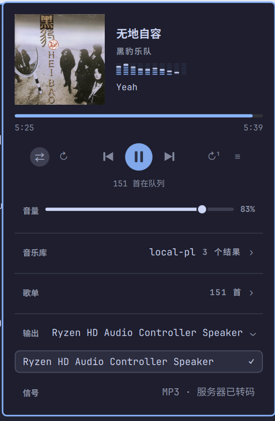

# Cliamp

[cliamp](https://www.cliamp.stream/), right in the Omarchy bar: now playing with album
art, in-panel Navidrome browsing, output routing, and a bit-perfect signal verdict —
proof the audio reaching your DAC is untouched. The transport gained four exclusive
modes — sequential, shuffle, repeat-all and repeat-one — the active playlist lives in
the panel, and lyrics resolved by cliamp itself fold under the controls. A footer
under a hairline names the build, checks GitHub for a newer one when the version is
clicked, and links home; in the same row, 退出 quits cliamp and the language label
switches the interface between 中文 and English in place.

The last one is the reason this exists. Nothing else on the machine can tell you that
a 44.1 kHz track is being quietly resampled to 48 kHz before it reaches the speakers,
which is what PipeWire does by default to everything.


## Features

- **A signal verdict** that only says "bit-perfect" when it really is, and otherwise
  names the specific thing in the way. It reads on the left of one row whose right
  side is the output, so "where is it going" and "is it still pure" answer side by
  side.
- **Transport**: play, pause, previous and next centered, flanked by two mutually
  exclusive mode buttons per side — sequential, shuffle, repeat-all and repeat-one —
  with the active mode pill-highlighted and a tooltip on every control. A scrubber
  hides itself for radio rather than pretending a stream can be seeked.
- **Now playing** with album art, artist and album, straight from cliamp's MPRIS
  interface, so it costs nothing while the panel is shut. A ten-bar analyzer spans the
  column underneath, drawn Winamp style as stacked LED segments with a falling peak
  cap, fed by PipeWire's own peak data rather than a second process.
- **Lyrics**, resolved by cliamp and shifted by the real output latency, so they line
  up with what you hear rather than with what has been decoded. A window of lines sits
  below the volume row with the current line large and centred while its neighbours
  fade by distance; a three-line toggle at the end of the volume row hides them. A
  track with no lyrics shows no line at all.
- **Output routing** on one line: OUTPUT and its device hang at the right beside the
  folding arrow, the verdict on the left, and the whole row opens the sink list.
  Switching here moves cliamp's own stream and leaves the system default alone, and
  when rate following is off a "Match rate" shortcut offers to retune the graph on the
  spot.
- **The current playlist in the panel**: the song list shows the active queue directly
  and is keyboard driven like the library. A filter narrows it by title or artist and
  keeps the queue numbers honest. The song being played is pill-highlighted and the
  list scrolls to it on every track change, so it never scrolls out of reach while you
  pick the next track.
- **The library is one search away**: one field searches songs, albums and saved
  playlists, and the playlist the song list is holding reads as the picked row.
- **Rate following**, on by default: the audio graph is retuned to the track's sample
  rate while cliamp plays, and released the moment it stops.
- **A footer that answers for itself**: a hairline sets it apart from the controls.
  The version on the left checks GitHub for updates when clicked, showing the verdict
  in a tooltip — clicking again re-checks. To its right sit **退出**, which quits cliamp
  gracefully and closes the panel (pulling the widget out of the bar too), the language
  name that toggles the Interface language setting between 中文 and English — the label
  shows the language the next click lands on — and the homepage link on the right that
  opens the repository. The whole interface answers in English or 中文 from the
  Interface language setting.



## The signal line

Three conditions must all hold before the words "bit-perfect" appear:

1. The server sent the original file. cliamp requests `format=raw` from Navidrome and
   gets untranscoded FLAC, so this normally holds for a self-hosted library.
2. The sink rate equals the stream rate, read back from the sink after any change,
   never assumed from the rate that was requested.
3. Gain is unity. cliamp must be at 0 dB, because any attenuation alters samples.
4. The EQ is flat. All ten bands must be zero, since any lift or cut is DSP. cliamp
   labels an untouched EQ "Custom", so the panel reads the band values and ignores the
   preset name. Set it with `cliamp eq Flat`.

| What you see | What it means |
| --- | --- |
| `FLAC 44.1 kHz · bit-perfect` | samples reach the DAC untouched |
| `44.1 → 48 kHz · resampled` | the graph is at a different rate |
| `88.2 → 96 kHz · output has no 88.2` | the rate was requested and the hardware substituted another |
| `44.1 kHz · SBC-XQ · lossy` | a Bluetooth sink, which re-encodes and can never be bit-perfect |
| `FLAC 44.1 kHz · EQ applied` | a band is lifted or cut, so the samples are processed |
| `FLAC 44.1 kHz · volume applied` | rates line up but a gain is being applied |
| `MP3 · transcoded by server` | the file was re-encoded before it ever arrived |

That third row matters more than it looks. Asking PipeWire for a rate the DAC does not
have lands on the nearest one it does, silently. The verdict is therefore always read
back from the sink, so the panel cannot claim a route it did not get.

## Keyboard

| Key | Action |
| --- | --- |
| `space` / `enter` | play or pause, or pick a device when the output list is open |
| `n` / `b` | next and back |
| `j` / `k` / `up` / `down` | move the cursor when a list is open |
| `h` / `l` / `left` / `right` | seek 5 seconds. Inert on a stream, where a seek would skip the track |
| `o` | open and close the output list |
| `t` | open and close the song list |
| `s` | toggle shuffle between the sequential and shuffle modes |
| `r` | cycle repeat-all, repeat-one and off |
| `p` | toggle rate following |
| `/` | open the library, which puts the keyboard in the search field |
| `f` | wake the headless cliamp daemon, only when nothing is running |
| `q` | quit cliamp: graceful SIGTERM, so it writes its resume state |
| `esc` | close |

Opening the library or the song list hands the keyboard to its search field, and while
a field has focus the panel stops watching keys at all: every key in the table above
goes to the field instead, so typing a name with a space or an `s` in it searches
rather than pausing and shuffling. Each field answers four keys itself: `up` and
`down` move the cursor, enter plays the highlighted row, and `esc` hands the keyboard
back to the panel, where a second `esc` closes it.

Left click opens the panel, right click plays or pauses without opening it.

## Requirements

- `cliamp` 2.0 or newer on `PATH`, whose socket speaks the version 2 IPC protocol
- PipeWire, with `pw-metadata` and `pactl` available, both of which ship with it
- `omarchy-audio-sink-availability`, part of Omarchy, used to hide outputs with
  nothing plugged into them
- `curl`, used by the footer's update check to ask GitHub for the latest release
- `python3`, used by `cliamp-pick-playlist` and `cliamp-resume-ipc` to read
  `resume.json` and speak to cliamp's IPC socket
- `ffmpeg`, used to pull an embedded album cover out of a local file when cliamp's
  status does not publish one (cliamp only fills its album-art cache from the TUI)

## Settings

| Setting | Default | Notes |
| --- | --- | --- |
| Seconds between status refreshes | 2 | polls while the panel is open, and always while native rate following is on |
| Match the audio graph rate to the track | on | see the warning below |
| Relaunch cliamp at the track's native rate | off | see the warning below |
| Lyric timing trim in milliseconds | 0 | added on top of the measured output latency |
| Hide the icon when cliamp is not running | on | |
| Path to cliamp | empty | empty means find it on `PATH` |
| Interface language | Auto | Auto follows the desktop locale; a pinned language (`English` or `中文`) keeps its strings |

## Notes worth reading once

**It runs headless.** `cliamp-daemon.service` keeps a daemon alive across logins, so
closing a terminal never stops the music. Pick a saved playlist from the panel's
Library section and it plays with nothing else open.

**The unit is sandboxed.** `cliamp-daemon.service` runs under `UMask=0077` with a
read-only system and home, writable only in `~/.config/cliamp`, all of `$XDG_RUNTIME_DIR`
and the state directory the sample-rate pin lives in, which `systemd-analyze --user
security` scores 3.7 rather than the 9.4 an unconstrained unit gets. What keeps the log,
the history file and the saved playlists private is the mode of `~/.config/cliamp`
itself: nothing inside a directory nobody else can enter is reachable whatever its own
mode says. The `chmod` at the end of Install is what puts it there, since `cliamp setup`
creates the directory before the unit ever starts and systemd leaves the mode of a
configuration directory it did not create alone. The umask is the second layer, and it
covers what the daemon creates rather than what a cliamp TUI creates in a terminal under
your login umask.

**The library is browsed in the panel, not in a terminal.** cliamp publishes the
current stream URL in its status, and that URL carries a salted Subsonic token, so
the panel reaches `getAlbumList2`, `getAlbum`, `getSong` and `search3` with it. Your
password is never handled here and never asked for. The token itself is a credential,
and it is the one cliamp already publishes and already writes into the playlist files
it saves, so nothing new is exposed and nothing is cached by this plugin.

Choosing an album or a song overwrites a single scratch playlist named `cliampui` and
loads it, which replaces the queue in place, so the daemon never stops and the music
never pauses to let you pick something. Reusing one file means browsing does not leave
a playlist behind every time you press something, at the cost of one reserved name: a
saved playlist called `cliampui` would be overwritten, so that name is hidden from the
browse list. Choosing a saved playlist row loads that playlist directly and writes
nothing. Whatever is at that name is replaced rather than written through, and the
file is created owner only, because its stream URLs carry the token.

**Browsing works before anything is playing.** The token is borrowed from whatever
cliamp is streaming, so a daemon that just started has none to lend. The playlists on
disk carry the same token in their stream URLs, and those are read instead, which means
the library is browsable from a cold start without anything being stored anywhere.

**One field searches songs, albums and saved playlists.** Rows are tagged with what
they are. Artists are not a row of their own, because an artist name already brings
up their albums and there would be nothing to play on an artist by itself. Choosing a
song plays that one song: cliamp has no jump-to-track command, so starting its album
from the right place is not something this can offer.

**The song list filters, the library searches.** Typing in the library asks the server
for matches, so the rows talk about what search3 found; the song list already holds the
whole queue, so its field only narrows what is on screen by title or artist, keeping
the numbers cliamp knows.

**Cliamp wakes headless, not in a terminal.** cliamp allows one instance per user, so
waking it while the daemon holds the socket would create a second, IPC-less copy this
panel cannot see. The Start row — and the `f` key — therefore appear only while the
socket is free. They wake the headless daemon in the background: the sandboxed
`cliamp-daemon.service` when the unit is installed, otherwise the same entry script run
detached, which still reads the sample-rate pin the native-rate relaunch writes. The
reconnect loop notices the socket the moment the daemon owns it, and nothing here opens
a terminal.

**The player resumes where it stopped, whichever way it was started.** The Start row, the
desktop icon and the shortcut all launch the same way: cliamp loads the playlist whose
file contains the saved track and position — `cliamp-pick-playlist` finds it by searching
the local playlists for the path in `resume.json`, so no playlist name is baked in — then
a shared helper (`cliamp-resume-ipc`) waits for the IPC socket and jumps the queue to the
saved track and position via the version 2 protocol. The same helper serves the headless
daemon and a TUI started from a terminal, so resume behaves identically everywhere.

**退出 hides the panel, and the shortcut only brings the icon back.** The bar keeps no
empty shell while nothing is playing: 退出 asks cliamp to quit gracefully and then hides
the widget. From a hidden bar icon the shortcut or the desktop icon restores just the icon
without opening the panel — clicking the icon expands it again.

**Lyrics are cliamp's, not this plugin's.** cliamp resolves them from embedded tags,
then LRCLIB, then NetEase, and answers the `lyrics` operation with a job whose result is
a list of timestamped lines. The panel submits the operation, then polls `job.get` until
the job is terminal, because on the version 2 socket an operation answers with a job
rather than the payload. The panel only draws the lines, so nothing here reaches the
network and a track with no lyrics shows no line at all.

**Lyrics are shifted to match the sound, not the decoder.** cliamp reports the position
it has decoded to, and PipeWire reports how far behind that the sink is: about 167 ms
over A2DP on this machine, against roughly nothing on the built-in output. That much is
subtracted automatically and re-read whenever the output changes. A headset also buffers
on the far side of the radio, where no host can measure it, so if the words still run
ahead of what you hear, add the difference with the lyric timing trim in settings.

**Navidrome tracks cannot be scrubbed.** They arrive as HTTP streams, and cliamp
cannot reposition one. Asking it to seek one skips to the next track instead, and on the
last track of a queue that presents as playback stopping. The progress bar is drawn from
the duration the server reports, but it is deliberately not interactive for a stream, and
the seek keys do nothing there. Local files scrub normally.

**The volume slider moves cliamp's PipeWire stream, not cliamp's own gain.** It is the
same thing the stock audio panel moves for `PipeWire ALSA [cliamp]`, so it changes only
this application and leaves the system volume alone. cliamp itself stays at 0 dB. Any
attenuation alters samples wherever it is applied, so anything under 100 percent costs
the bit-perfect verdict and the signal line says `volume applied`. Right click the
slider to return to unity.

**Rate following affects every application, not just cliamp.** The sample rate belongs
to the whole audio graph. While your music plays at 44.1 kHz, a browser playing 48 kHz
audio is the thing being resampled instead. It is released as soon as playback stops,
so the effect lasts exactly as long as the music. Turn it off in settings if that trade
is wrong for you.

**Native rate following is off by default, and it works with the panel closed.**
cliamp fixes its output rate when it starts and has no command to change it, so playing
a 96 kHz file natively means restarting the daemon. That gaps the audio, and because
cliamp has no jump-to-track command and cannot seek a stream, a Navidrome queue comes
back at its first track; in a queue that mixes rates, skipping across a rate boundary
therefore lands back on the first track. Turning the setting on keeps the status poll
running, one socket request per interval, so the rate follows every track change
whether or not the panel is open. Turn it on if you play local hi-res files and want
the last resampler out of the path.

**The footer checks GitHub for updates.** The version under the hairline is this
plugin's own build. Clicking it asks the GitHub releases API of this repository for the
latest tag, compares it with the local build, and shows the answer in a tooltip — up to
date, or a newer version number to click for re-check. It needs `curl` and a route to
`api.github.com`; without either it says the check failed. The homepage link beside it
opens the repository, and the update check itself runs only when the version is clicked.

**Bluetooth can never be bit-perfect, and that is not a Linux limitation.** A2DP
carries SBC, AAC and similar, all lossy. AirPods offer only SBC, SBC-XQ and AAC, so
there is no lossless path to them from any operating system. Apple does not send
lossless over Bluetooth either; only AirPods Max on a wired USB-C connection carries
it. The panel names the codec in use so you can pick the least-bad one with the
Bluetooth settings, but none of them will earn a bit-perfect verdict.

**Enable this or the stock Media widget, not both.** They will both show the same track.

**A hard shell crash can leave the graph rate forced.** The panel releases it on a
clean shutdown, and the setting is session scoped, so restarting PipeWire clears it:

```bash
systemctl --user restart pipewire
```

## Install

```bash
omarchy plugin add https://github.com/ehlxr/omarchy-cliampui --enable
omarchy bar put io.github.ehlxr.cliampui --section right
```

`omarchy plugin add` is what keeps `omarchy plugin update` able to manage the copy
afterwards. A hand cloned folder works but is invisible to that command.

Then, once, point cliamp at your library and start the daemon:

```bash
cliamp setup
install -Dm644 ~/.config/omarchy/plugins/io.github.ehlxr.cliampui/cliamp-daemon.service ~/.local/share/systemd/user/cliamp-daemon.service
systemctl --user daemon-reload
systemctl --user enable --now cliamp-daemon.service
chmod -R go= ~/.config/cliamp
```

The `chmod` sweeps what the unit does not: `cliamp setup` and the TUI both run under
your login umask, and systemd sets the directory mode only when it creates the directory
itself, so an install that predates the sandbox keeps its old modes. Run it again after a
long TUI session if you want the files themselves owner-only rather than only unreachable.

`cliamp setup` is what writes your Navidrome server into `~/.config/cliamp/config.toml`.
Without it the provider does not appear in cliamp at all, and the daemon has nothing to
play.

## Removal

```bash
systemctl --user disable --now cliamp-daemon.service
rm -f ~/.local/share/systemd/user/cliamp-daemon.service
cliamp playlist delete cliampui
rm -rf ~/.local/state/omarchy/cliampui
omarchy plugin remove io.github.ehlxr.cliampui
```

`cliampui` is the scratch playlist the panel overwrites on every play, and its resolved
stream URLs carry your salted Subsonic token, so it goes with the plugin. The state
directory holds the one shot sample rate the daemon reads at startup, the covers the
panel has extracted from local files (keyed by file, so they are not re-peeled), and it
goes too.

## This is a fork

Forked from [thisisgm/omarchy-cliampui](https://github.com/thisisgm/omarchy-cliampui).
Compared with that upstream `main`:

- Speaks cliamp's **version 2 IPC protocol**, where operations answer with a job
  that is polled via `job.get` instead of returning the payload directly.
- Reworked the **transport** into four mutually exclusive mode buttons —
  sequential, shuffle, repeat-all and repeat-one — with the active mode
  pill-highlighted and a tooltip on every control.
- Kept the **playlist in the panel** as a song list that filters by title or artist,
  keeps the real queue numbering, and scrolls to the playing song (pill-highlighted)
  instead of pinning it at the top.
- Added the **library to the same panel**, browsed over the published Subsonic token:
  one search field covers songs, albums and saved playlists.
- Merged **output and signal onto one row** — the verdict on the left, OUTPUT and its
  device on the right beside the fold arrow — with a one-click "Match rate" shortcut
  when the rates disagree.
- Added **lyrics in the panel**, drawn from cliamp's own resolution, shifted by output
  latency, with a toggle on the volume row and a large centred active line.
- Added a **footer** under a hairline: the build version checks GitHub for updates when
  clicked, and the homepage link opens the repository.
- Moved the user-visible strings into `Strings.js` with English and Chinese tables and
  a test of its own, and extended the model tests for version 2 lines.
- Lives under the `io.github.ehlxr` namespace at manifest `0.1.14`.

## Development

`Model.js` is pure JavaScript with no QML imports, so it is covered by tests:

```bash
deno run --allow-read tests/model.test.js
```

`Strings.js` likewise answers to its own suite, which checks that every key the panel
reads exists in both languages:

```bash
deno run --allow-read tests/strings.test.js
```

The model fixtures are lines a running cliamp actually printed, including the 88.2 kHz
substitution this machine performs.

## Support

If this saved you an afternoon, you can
[buy me a coffee](https://buymeacoffee.com/thisisgm).

## License

MIT